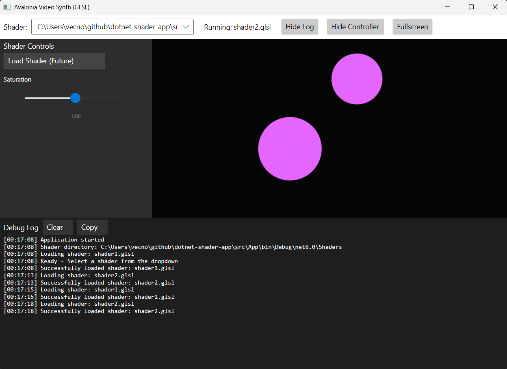

# dotnet-shader-app

This repository contains a template for a .NET GLSL application built with [Avalonia UI](https://avaloniaui.net/). The purpose is to build a live shader editing and real-time (perhaps neural) rendering. 



### 
```powershell
# Option 1: PowerShell Scripts (Recommended)
# First time setup
.\update.ps1
.\start.ps1
# Option 2: Direct .NET Commands
dotnet restore src/App/AvaloniaVideoSynth.csproj
dotnet run --project src/App/AvaloniaVideoSynth.csproj
```

## Requirements

- .NET 8.0 SDK or later
- OpenGL 3.3 compatible graphics driver
- Windows 11 (tested)

```
[net8.0]: 
   Top-level Package                    Requested    Resolved
   > Avalonia                           11.1.3       11.1.3
   > Avalonia.Desktop                   11.1.3       11.1.3
   > Avalonia.Diagnostics               11.1.3       11.1.3
   > Avalonia.Themes.Fluent             11.1.3       11.1.3
   > Microsoft.NET.ILLink.Tasks   (A)   [8.0.20, )   8.0.20

(A) : Auto-referenced package.
```
