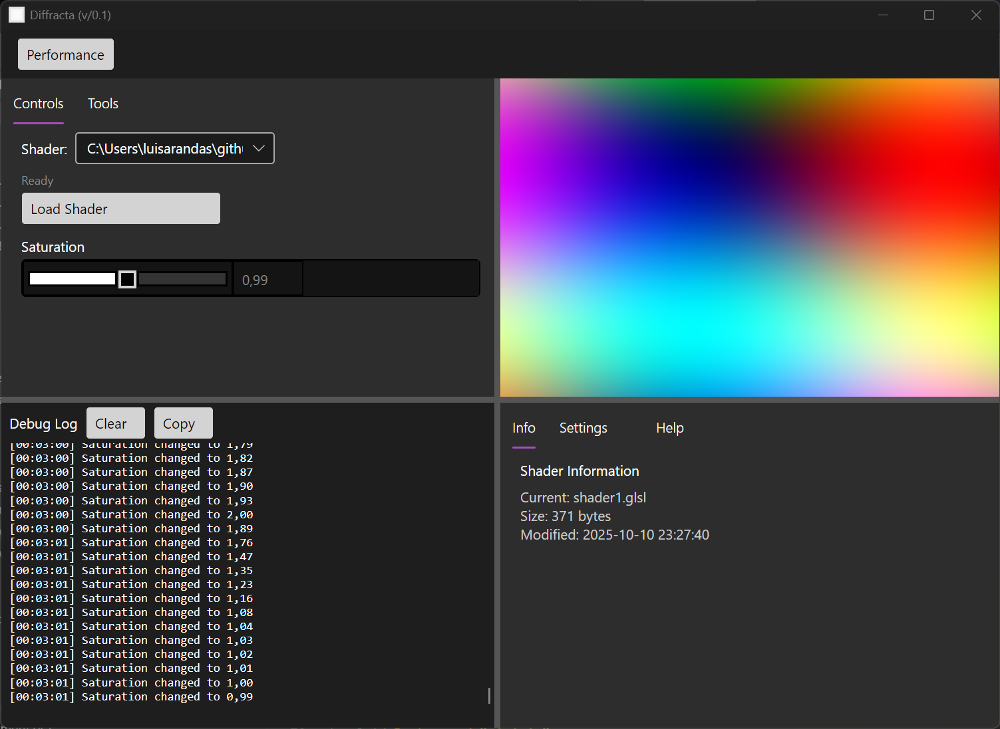

# Diffracta

This repository contains the code for Diffracta, a GLSL video application built with .NET and [Avalonia UI](https://avaloniaui.net/). The purpose is to build an open-source and professional solution for live video editing and cinema. (perhaps neural rendering too)



```powershell
# Option 1: PowerShell Scripts (Recommended)
# First time setup
.\update.ps1
.\start.ps1
# Option 2: Direct .NET Commands
dotnet restore src/App/Diffracta.csproj
dotnet build src/App/Diffracta.csproj
dotnet run --project src/App/Diffracta.csproj
```

### Requirements

- .NET 8.0 SDK or later
- OpenGL 3.3 compatible graphics driver
- Windows 11 (tested)

```
[net8.0]: 
   Top-level Package                    Requested    Resolved
   > Avalonia                           11.1.3       11.1.3
   > Avalonia.Desktop                   11.1.3       11.1.3
   > Avalonia.Diagnostics               11.1.3       11.1.3
   > Avalonia.Themes.Fluent             11.1.3       11.1.3
   > Microsoft.NET.ILLink.Tasks   (A)   [8.0.20, )   8.0.20

(A) : Auto-referenced package.
```

### Features

- Allows to load *.glsl shaders    
- Stacks shaders for post-processing  
- Has a Performance Mode (fullscreen, hides mouse)  

### Roadmap
 
- Divide the Log window to view the current shader    
- Add a set of like 10 post-process shaders stacked that we can gate - e.g. barrel   
- Check the slider design  
  
