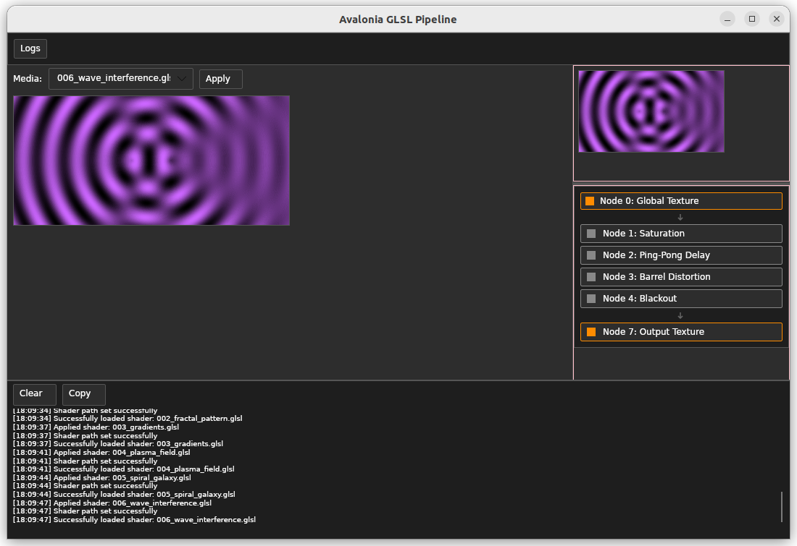

# AvaloniaGlslPipeline

AvaloniaGlslPipeline is a .NET desktop application built with Avalonia UI that loads and runs GLSL fragment shaders in real time.



### Reproduce

```sh
# Ubuntu
./scripts/setup_environment.sh   # first time
./scripts/start_app.sh           # to launch

# Windows 11
dotnet restore src/App/AvaloniaGlslPipeline.csproj
dotnet build src/App/AvaloniaGlslPipeline.csproj
dotnet run --project src/App/AvaloniaGlslPipeline.csproj

```
