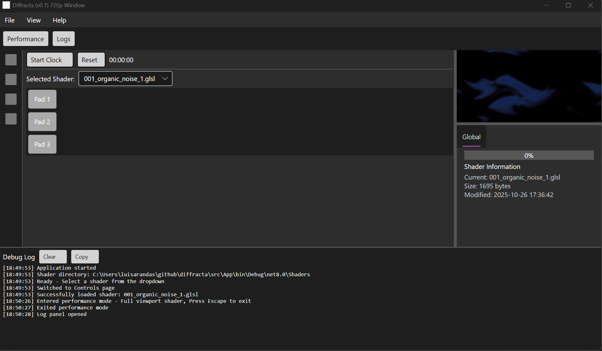

# Diffracta

This repository contains Diffracta, a desktop application for live video editing and cinema. It is built using .NET and [Avalonia UI](https://avaloniaui.net/). [Under heavy development]



### Build desktop app on Windows 11

```powershell
# Option 1: PowerShell Scripts (Recommended)
# First time setup
.\update.ps1
.\start.ps1
# Option 2: Direct .NET Commands
dotnet restore src/App/Diffracta.csproj
dotnet build src/App/Diffracta.csproj
dotnet run --project src/App/Diffracta.csproj
```

### Requirements

- .NET 8.0 SDK or later
- OpenGL 3.3 compatible graphics driver
- Windows 11 (tested)

```
[net8.0]: 
   Top-level Package                    Requested    Resolved
   > Avalonia                           11.1.3       11.1.3
   > Avalonia.Desktop                   11.1.3       11.1.3
   > Avalonia.Diagnostics               11.1.3       11.1.3
   > Avalonia.Themes.Fluent             11.1.3       11.1.3
   > Microsoft.NET.ILLink.Tasks   (A)   [8.0.20, )   8.0.20

(A) : Auto-referenced package.
```

### Build/Run Docker on Windows 11/WSL

```sh
# Enable WSL2 and Virtual Machine Platform (recommended)
# If Docker Desktop does not detect a Hypervisor and stops running,
# Run PowerShell as Administrator:
dism.exe /online /enable-feature /featurename:Microsoft-Windows-Subsystem-Linux /all /norestart
# Enable Virtual Machine Platform (required for WSL2)
dism.exe /online /enable-feature /featurename:VirtualMachinePlatform /all /norestart
# Set WSL2 as default
wsl --set-default-version 2
# Restart your computer
Restart-Computer
```

```sh
# Build the image and launch the app
# 1) Build the image
docker build -t diffracta:latest .
# 5) Run the container (prefer host.docker.internal; fall back to host IP)
docker run --rm -e DISPLAY='host.docker.internal:0.0' -e LIBGL_ALWAYS_INDIRECT=1 diffracta:latest

```

```sh
# Docker Utils
# List all Docker images
docker images
# Or shorter version
docker image ls
# List all running containers
docker ps
# List ALL containers (running and stopped)
docker ps -a
# Or shorter version
docker container ls -a

# Remove a specific image
docker rmi diffracta:latest
# Remove by image ID
docker rmi <IMAGE_ID>
# Force remove (even if in use - use with caution!)
docker rmi -f diffracta:latest
# Remove all unused images
docker image prune
# Remove ALL unused images (not just dangling)
docker image prune -a
# DANGEROUS: Remove ALL images
docker rmi $(docker images -q)
```


